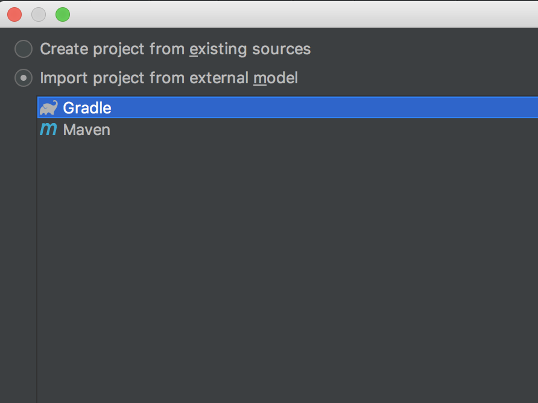
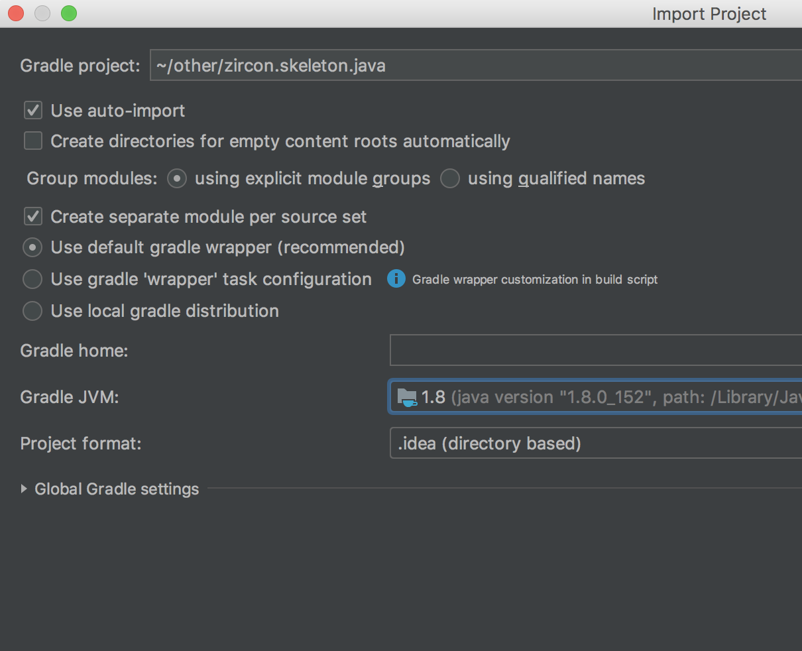
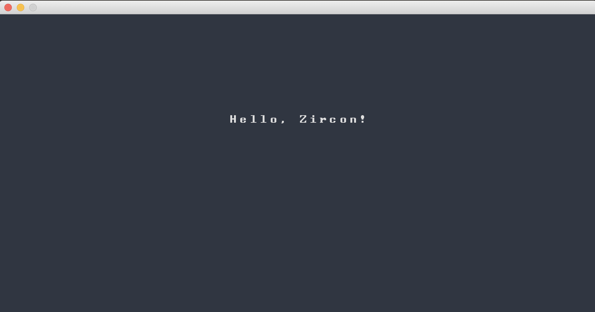

# Zircon Kotlin Skeleton Project

This is a skeleton project for Zircon users which can be used to get started with Zircon.

## Getting started

This project works on all platforms but there are some prerequisites which must be installed
before you can start coding.

1. *Git.* (optional)
    Git is a version control system. If you use GitHub you are already familiar with it.
    You don't need extensive Git knowledge to work with this project, but you need to install Git
    on your system if you want to clone / fork this project. You can get it [here](https://git-scm.com/).
    Alternatively you can download the zip / tarball from the [Releases page](https://github.com/Hexworks/zircon.skeleton.kotlin/releases).
2. *Java*
    This project uses Kotlin so you must install a Java *JDK* to get started. We suggest [OpenJDK](https://openjdk.java.net/install/)
    but any other JDK will do. Java 8 or above is recommended.

That's all!

## Setting up

In order to set up a local dev environment on your computer you need to follow these steps:

## Check the project out. (optional)

If you want to use Git to clone the project you need to navigate to a folder where you want
to check the project out in a terminal and type the following command:
```bash
git clone https://github.com/Hexworks/zircon.skeleton.kotlin.git
```
Alternatively you can just download and extract the latest release form the [Releases page](https://github.com/Hexworks/zircon.skeleton.kotlin/releases).

## Import the project to your IDE.

It is highly recommended to use IntelliJ IDEA for this project. You can get the free community
version from [this page](https://www.jetbrains.com/idea/download/#section=mac). You don't need
to buy the Ultimate version, the Community Edition is perfectly fine.

Importing the project is pretty simple. When IDEA is started you need to

1. Click **Import Project**
2. Select the directory where your project resides (the project directory itself)
3. In the following dialog select *Gradle*:
   
4. Then select "Use auto import" and also a JDK as seen here:
   
   Note that you'll need to tell IDEA about where your JDK is because it will probably
   not detect your installation. More info about getting started with IDEA can be found
   [here](https://www.jetbrains.com/help/idea/install-and-set-up-product.html)
5. You are ready to go!

## Notes about Gradle

This project uses the [Gradle build tool](https://docs.gradle.org/current/userguide/userguide.html).
You don't need to be a Gradle expert to get started with the project. Gradle is bundled to
this project and can be invoked by running the `gradlew` script.

> For Windows users it is recommended to use [Git Bash](https://git-scm.com/downloads) to run it.

This means that you don't need to install anything, everything is in place to get you started.

In order to build your project you'll need to run the following command in your project directory:

```bash
./gradlew clean build
```

> If you get a permission denied error you'll need to add execution permissions to `gradlew`
> this way: `chmod +x gradlew`

Running this command will create an artifact in the `build/libs` directory which contains a `Main`
class so you can run your project right away by typing this command:

```bash
java -jar build/libs/zircon.skeleton.kotlin-1.0.1.jar
```

You'll be presented by a new window with a greeting:



**Congratulations!** You just run your first Zircon program!

## Development resources

- To get started with Zircon you can check the Zircon Project Page on our website [here](https://hexworks.org/projects/zircon/)
- If you get stuck with Zircon feel free to come up to our [Discord channel](https://discordapp.com/invite/vSNgvBh)
  where you can ask us and other Zircon users
- The [Roguelikedev Subreddit](https://www.reddit.com/r/roguelikedev/) is also a good source of
  information
- To learn about Gradle check out their official documentation page [here](https://docs.gradle.org/current/userguide/userguide.html)
- If you want to get acquainted with the testing tools used in this project check out the
  docs of [AssertJ](http://joel-costigliola.github.io/assertj/)
- If nothing helps or if you think that there is a bug in this project feel free to open
  a new issue [here](https://github.com/Hexworks/zircon.skeleton.kotlin/issues/new).

## Credits

The "tetris" tileset was contributed by [CO](https://github.com/EdgeWasherMcgee/Tetris) (Thanks!)
